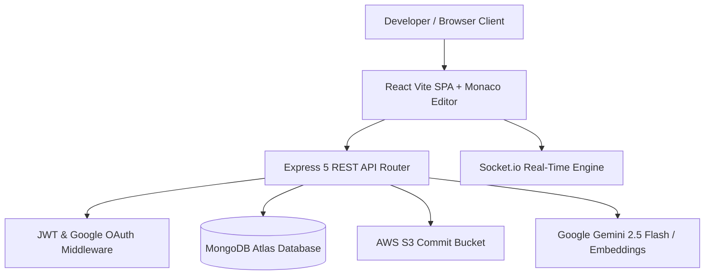

# 🚀 ForjeX — AI-Native Code Hosting & Autonomous Engineering Platform

<p align="center">
  
</p>

<p align="center">
  <strong>An AI-native code hosting platform featuring Monaco Editor, S3 version control, real-time Socket.io collaboration, and an embedded suite of 11 Autonomous AI Agents powered by Google Gemini.</strong>
</p>

<p align="center">
  <a href="https://forje-x.vercel.app"><strong>🌐 Live Demo</strong></a> •
  <a href="https://github.com/kiran-p-16/ForjeX"><strong>📦 GitHub Repo</strong></a>
</p>

---

## 🌟 Key Highlights & Engineering Features

### 💻 1. Production-Grade Code Studio
- **VS Code Monaco Engine**: Full browser-based code editing & viewing with syntax highlighting across 20+ languages.
- **S3 Version Control**: Push, pull, commit history, and file snapshotting backed by AWS S3.
- **Directory Explorer**: Drag-and-drop file and folder tree navigation.

### 🌐 2. Real-Time Collaboration & Social Hubs
- **Real-Time Notifications**: Socket.io push notifications for stars, follows, issues, and AI code reviews with unread counter badge.
- **Discover Hub (`/discover`)**: Browse public repositories filtered by language/tech stack and search developer profiles.
- **Collaborate Hub (`/collaborate`)**: Aggregate open community issues looking for open-source contributors.
- **Real 365-Day Heatmap**: Activity contribution grid calculated from real repository edits and star events.

### 🧠 3. Embedded Multi-Agent AI Suite (11 Gemini-Powered Features)

```
┌─────────────────────────────────────────────────────────────────────────┐
│                      FORJEX MULTI-AGENT ENGINE                          │
├────────────────────────────────────────┬────────────────────────────────┤
│ Specialized Agent                      │ Autonomous Capability          │
├────────────────────────────────────────┼────────────────────────────────┤
│ 1. Autonomous Issue-to-PR Resolver     │ Multi-file code fix & PR patch │
│ 2. Repository Architecture Graph       │ AST-based Mermaid.js diagrams  │
│ 3. Autonomous Test Suite Generator     │ Production Jest tests w/ mocks │
│ 4. Agentic Multi-File Refactoring      │ Parallel multi-file code refactor│
│ 5. SAST Security Vulnerability Patcher │ OWASP Top 10 security patches  │
│ 6. Smart Code Reviewer                 │ File audit & 0-100 health score│
│ 7. AI Issue Triage Bot                 │ Auto-labeling & priority triage│
│ 8. Natural Language Code Search        │ Conversational codebase Q&A    │
│ 9. Documentation Generator             │ GitHub README.md auto-generator│
│ 10. Commit Intelligence Assistant      │ Conventional Commit suggestions│
│ 11. AI Code Explainer Sidecar          │ Multi-level ELI5 & logic breakdown│
└────────────────────────────────────────┴────────────────────────────────┘
```

---

## 🏗️ System Architecture



---

## 🛠️ Tech Stack

| Tier | Technologies |
|:-----|:-------------|
| **Frontend** | React 18, Vite 7, Monaco Editor, Socket.io Client, Styled Components |
| **Backend** | Node.js, Express 5, Mongoose, Socket.io, Multer, Yargs |
| **Database** | MongoDB Atlas |
| **Cloud Storage** | AWS S3 SDK v3 (`@aws-sdk/client-s3`) |
| **AI Engine** | Google Gemini API (`@google/genai`), `gemini-2.5-flash`, `text-embedding-004` |
| **Deployment** | Vercel (Frontend), Railway (Backend) |

---

## 🚀 Local Development Setup

### 1. Clone Repository
```bash
git clone https://github.com/kiran-p-16/ForjeX.git
cd ForjeX
```

### 2. Install Dependencies
```bash
# Install backend dependencies
cd backend && npm install

# Install frontend dependencies
cd ../frontend && npm install
```

### 3. Environment Configuration
Create `.env` inside `backend/`:
```env
PORT=3000
MONGODB_URI=your_mongodb_connection_string
JWT_SECRET_KEY=your_jwt_secret
GEMINI_API_KEY=your_gemini_api_key
FRONTEND_URL=http://localhost:5173
```

Create `.env` inside `frontend/`:
```env
VITE_API_URL=http://localhost:3000
VITE_GOOGLE_CLIENT_ID=your_google_client_id
```

### 4. Run Locally
```bash
# Start Backend
cd backend && npm run dev

# Start Frontend (in new terminal)
cd frontend && npm run dev
```

---

## 📜 License
Licensed under the [ISC License](LICENSE).
